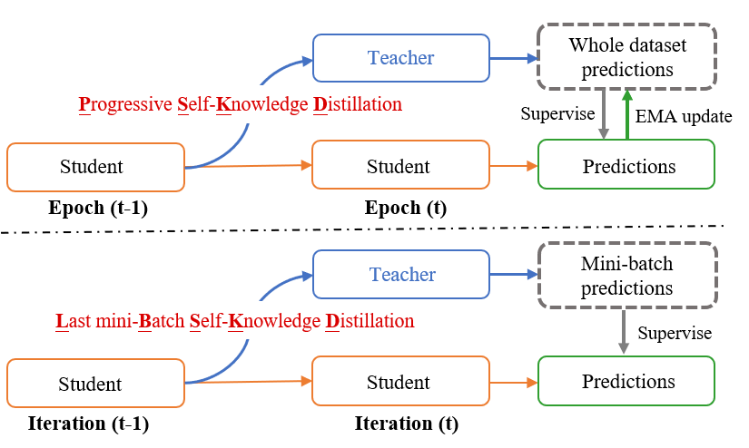
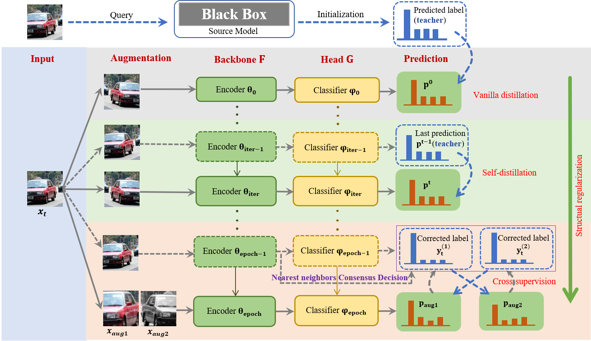
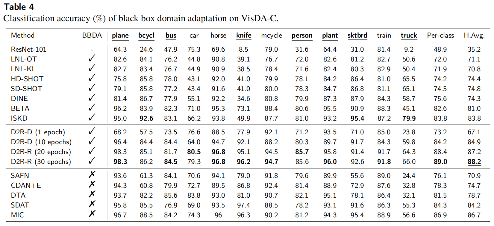

# Official implementation for **D2R**

## [**D2R: From On-target Self-Distillation to Refine with Cross-supervision for Black-Box Domain Adaptation**]()

### Problem and our improvement: 

### Our framework (Distill to Refine):  

### Prerequisites:
- python == 3.6.8
- cudatoolkit == 11.0
- pytorch ==1.7.1
- torchvision == 0.8.2
- numpy, scipy, sklearn, PIL, argparse, tqdm

### Demo:

- [ ] Configure the pytorch environment

- [ ] Run the following code (**reproduce the results for ResNet-101 (source backbone) -> ResNet-101 (target backbone) in upper Table 4**) 

   - training the source model

     > python D2R.py --gpu_id 0 --seed 2021 --output_src ./ckps/src --dset VISDA-C --s 0 --da uda --net_src resnet101 --max_epoch 10 --batch_size 64 --lr 1e-3
   
   - training the target model (D2R)
     
     > python D2R.py --gpu_id 0 --seed 2021 --output_src ./ckps/src --dset VISDA-C --s 0 --da uda --net_src resnet101 --max_epoch 30 --net resnet101 --output ./ckps/tar --distill --topk 1 --batch_size 32  --lr 1e-3

### Results:  

### Contact

- [erhul_aust@163.com](erhul_aust@163.com)
